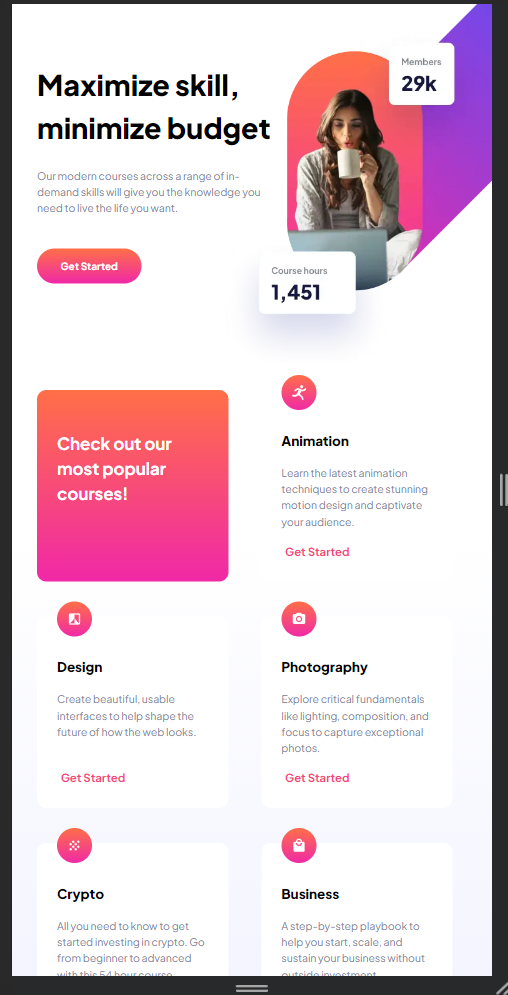
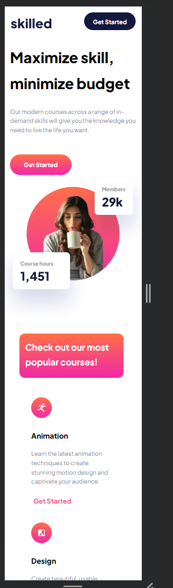

# Frontend Mentor - Skilled e-learning landing page solution

This is a solution to the [Skilled e-learning landing page challenge on Frontend Mentor](https://www.frontendmentor.io/challenges/skilled-elearning-landing-page-S1ObDrZ8q). Frontend Mentor challenges help you improve your coding skills by building realistic projects.

## Table of contents

- [Overview](#overview)
  - [The challenge](#the-challenge)
  - [Screenshot](#screenshot)
  - [Links](#links)
- [My process](#my-process)
  - [Built with](#built-with)
  - [What I learned](#what-i-learned)
  - [Continued development](#continued-development)
  - [Useful resources](#useful-resources)
- [Author](#author)

## Overview

### The challenge

Users should be able to:

- View the optimal layout depending on their device's screen size
- See hover states for interactive elements

### Screenshot





### Links

- Solution URL: [Add solution URL here](https://github.com/rainSaxFrontend-Mentor-Projects/Skilled-e-learning-landing-page)
- Live Site URL: [Add live site URL here](https://rainsaxfrontend-mentor-projects.github.io/Skilled-e-learning-landing-page/)

## My process

### Built with

- Semantic HTML5 markup
- CSS custom properties
- Flexbox
- CSS Grid

### What I learned

My major learnings in this project were all related to CSS. These include the best practice way to declare box-sizing: border-box for a stylesheet, use of the clamp() function for responsive resizing of fonts and even images, as well as a css trick of using width: calc(100% - [fixed_amount]) for responsive width of an element.

```css
html {
    box-sizing: border-box;
    ...
}

*,
*::before,
*::after {
    box-sizing: inherit;
}

```

### Continued development

In future projects I want to continue focusing on understanding the box model more clearly as well as how setting a width vs not setting a width will affect the rendered outcome.

### Useful resources

- [Resource detailing the box model](https://css-tricks.com/the-css-box-model/) - I came across this article while reading about box-sizing. it helped reinforce my understanding of how elements are structured.
- [article on box-sizing](https://css-tricks.com/box-sizing/) - Eye opening article (for me) which went into detail on how box-sizing: border-box makes it so padding and borders do not add to the declared width, making creation of layouts an easier process.
- [codepen](https://codepen.io/) - a very useful tool for jumping right in and writing some code for testing. I used it to better understand the difference between default content-box and border-box.
- [Fluid typography calculator](https://royalfig.github.io/fluid-typography-calculator/) - useful tool for generating clamp function given max and min font sizes and max and min viewport sizes.

## Author

- Frontend Mentor - [@rainSax](https://www.frontendmentor.io/profile/rainSax)
